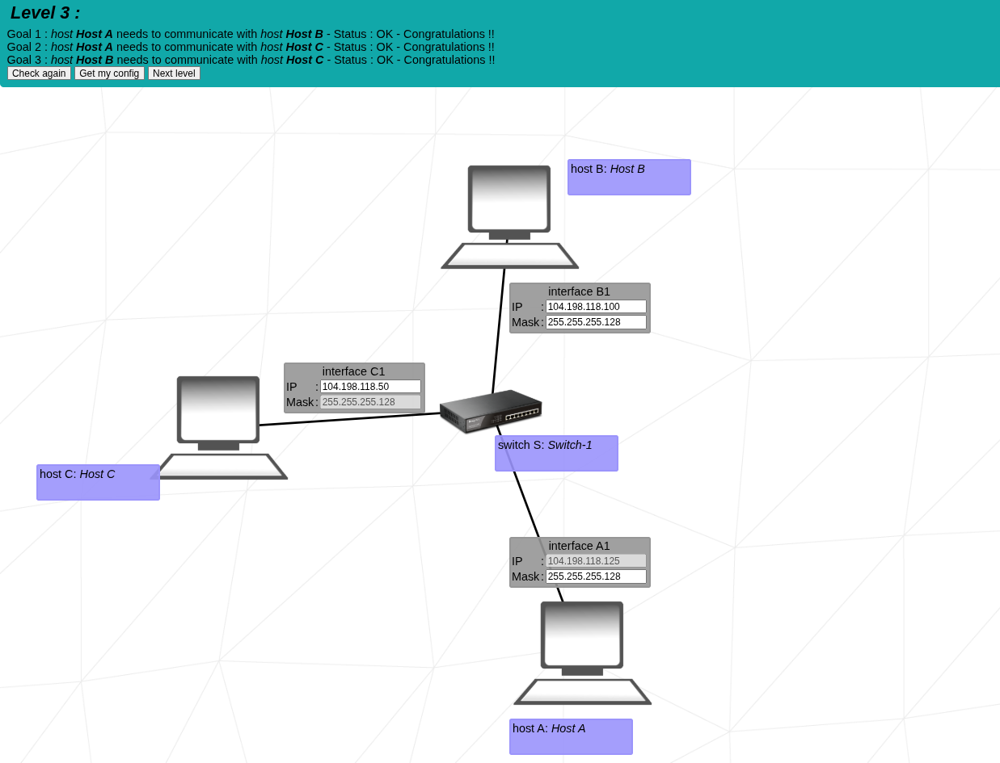
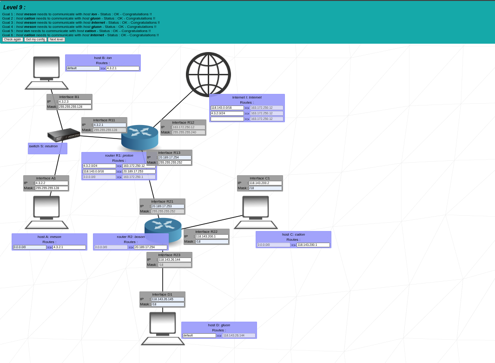

# Project Overview
NetPractice is a network configuration training project at 1337 School.
It focuses on learning IPv4 addressing, subnetting, and basic routing by solving interactive network configuration exercises.
The goal is to correctly assign IP addresses, subnet masks, and gateways so that all hosts in the given topology can communicate.

# My Solutions
Below are screenshots of how I solved each exercice:

	
Level1

	 
	
	 

---

	
Level2

	 
	
	 

---

	
Level3

	 
	
	 

---

	
Level4

	 
	
	 

---

	
Level5

	 
	
	 

---

	
Level6

	 
	
	 

---

	
Level7

	 
	
	 

---

	
Level8

	 
	
	 

---

	
Level9

	 
	
	 

---

	
Level10

	 
	
	 

 

# Related Work
I also created a repository that explains networking basics and subnetting in detail:  
🔗 [Networking Basics & Subnetting Guide](https://github.com/Mohamed-ait-alla/network-notes)

# References
- [Network Basics](https://www.youtube.com/watch?v=S7MNX_UD7vY&list=PLIhvC56v63IJVXv0GJcl9vO5Z6znCVb1P)
- [TCP/IP Addressing](https://www.ibm.com/docs/en/aix/7.2.0?topic=protocol-tcpip-addressing)
- [IP Address Guide](https://www.ipaddressguide.com/cidr)
- [Cisco Packet Tracer (for practice)](https://www.netacad.com/courses/packet-tracer)
